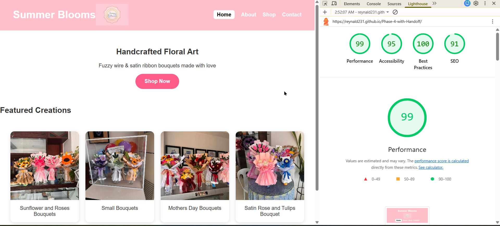

# HANDOFF REPORT — Summer Blooms

## Design Tokens

:root {
  --color-primary: pink;
  --color-secondary: #ffd1dc;
  --color-neutral: #333;
  --color-bg: white;

  --space-sm: 8px;
  --space-md: 16px;
  --space-lg: 32px;

  --font-main: Arial, sans-serif;
}

---

## Accessibility Statement

This website was tested using Google Lighthouse in Chrome DevTools and achieved an Accessibility score of 90+.

### Accessibility Improvements Implemented:
- Semantic HTML structure using header, main, nav, and footer
- All images include descriptive alt attributes
- Proper heading hierarchy (H1 → H2 structure)
- Navigation includes aria-label for screen readers
- Sufficient color contrast for readability
- Buttons and links are clearly labeled and accessible

### Lighthouse Report Evidence:

---

## BEM Index

### Header
- .header
- .header__logo-text
- .header__logo-image

### Navigation
- .nav
- .nav__list
- .nav__link

### Hero Section
- .hero
- .hero__content
- .hero__title
- .hero__text

### Gallery
- .gallery
- .gallery__grid
- .gallery__card
- .gallery__image
- .gallery__overlay

### Products
- .products
- .products__grid
- .products__card
- .products__image
- .products__price

### Button
- .shop-button

### Footer
- .footer

---

## Performance & Code Quality

- Images optimized using appropriate sizing and lazy loading
- Clean CSS with no unused or duplicate rules
- Responsive layout using CSS Grid and Flexbox
- No console errors detected
- All navigation links are functional
- Site is fully deployed on GitHub Pages

---

## Final Notes

This project is a fully responsive, accessible, and optimized e-commerce-style website for handcrafted floral products. It follows BEM methodology and modern web design practices.
